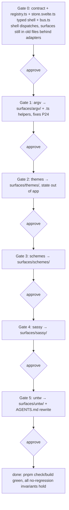

## Context

This tech spec implements [product.md](product.md). Behavior invariants below are cited as
"P#". Code references are pinned to commit `ee2feae`.

**How surfaces work today.** `src/lib/states.js@ee2feae` is a plain-JS `STATES` array
(`{ id, label, full, badge? }`) and the single source of truth for the header nav.
`src/routes/+page.svelte@ee2feae` imports all five surface components (lines 3–7), reaches
directly into three surfaces' state/helpers (`sassy`, `untw`, `argv` — lines 9–16), and:

- holds Themes persistence as shell functions: `loadProject` (32–50), `save` (52–65),
  `buildThemes` (68–78), `packageVsix` (81–93), `keydown`/Cmd-S (95–100), and a startup
  `$effect(loadProject)` (102–104);
- renders per-surface **toolbars** in the header `.conditional` zone via an `{#if app.view === …}`
  chain (131–165);
- renders the active surface body via a second `{#if}/{:else if}` chain plus the fallback picker
  (169–198).

**The collision (P-Problem, P24).** The header's Argv toolbar (144–150) declares shell-local
`spec`/`sel`/`saving`/`usage` (25–27) and its buttons call `reset` (never defined in the shell)
and `save()` — which at line 52 is *Themes'* save (`invoke('save', { doc: app.doc })`).
Meanwhile the **working** Argv `spec`/`sel`/`saving`/`reset()`/`save()` (the latter calling
`invoke('argv_save')`) live inside `src/lib/ArgvBench.svelte@ee2feae` (11–37). The toolbar was
split from the surface's real state and silently wired to the wrong functions. This is the exact
failure the contract removes: a surface's toolbar and body share one state module.

**State ownership today.** `src/lib/store.svelte.js@ee2feae` is the untyped `app` rune holding
shell fields (`view`, `busy`, `msg`, `kind`) mixed with Themes/Schemes data (`dir`, `vsix`,
`doc`, `schemes`, `schema`, `cur`, `file`, `dirty`) plus `say()`, `theme()`, `eff()`, `recents`.

**The contract template already exists.** `src/lib/sass/state.svelte.ts@ee2feae` and
`src/lib/untw/state.svelte.ts@ee2feae` are the pattern every surface will follow: a `$state`
object plus action functions, with the toolbar (in the header) and body (the surface component)
both importing the same module. `argv/` is a folder of loose `.js`; Themes and Schemes have no
module.

**Build constraints.** `tsconfig.json@ee2feae`: `strict`, `allowJs: true`, `checkJs: false`,
`verbatimModuleSyntax: true` (so type-only imports must use `import type`), `resolveJsonModule`.
`src/routes/+layout.js@ee2feae` sets `prerender = true`, `ssr = false` — the shell is a single
static client bundle, so the registry is imported at build time (no dynamic server routing).

Relevant files: `src/lib/states.js`, `src/lib/store.svelte.js`, `src/routes/+page.svelte`,
`src/lib/{ThemesSurface,SchemeBrowser,ArgvBench,ConvertSurface,UntwSurface}.svelte`,
`src/lib/{sass,untw,argv}/*`, `AGENTS.md` (`## New Surface/Tab`).

## Proposed changes

### 1. Typed contract (`src/lib/surface.ts`, new)

A `Surface` type describing a registry entry (satisfies P1–P3, P6, P14):

```ts
import type { Component } from 'svelte'
export interface Surface {
  id: string                    // equals STATES id and folder name
  label: string
  full: boolean                 // full-width vs 250px sidebar (P7)
  badge?: (shell: Shell) => string | number | null
  component: Component          // root body component
  toolbar?: Component           // optional header .conditional content
  load?: () => void | Promise<void>   // persistence hook (P14–P16)
}
```

`toolbar` is a component (not a snippet) so it can `import` its surface's state module and stay
colocated with the surface — this is what reconnects Argv's toolbar to Argv's state (P24). A
surface omits `toolbar`/`load` when it has none, and the shell renders correctly without them
(P2, P16).

### 2. Fully-typed state layer (resolves the product's resolved-decision)

- **`src/lib/states.js` → `src/lib/surfaces/registry.ts`** (typed `Surface[]`). Each entry
  imports its surface's `component` and optional `toolbar`/`load`. This is the wiring point;
  `+page.svelte` imports only the registry (P4, P5). Keeping the array in `surfaces/` (not a bare
  `states.ts`) colocates it with the folders it references; a thin `src/lib/states.ts` may
  re-export it if any existing import path depends on the name.
- **`src/lib/store.svelte.js` → `src/lib/store.svelte.ts`**, retyped to **shell-only** state
  (P10): `Shell = { view: string; busy: boolean; msg: string; kind: '' | 'ok' | 'bad' | 'busy' }`.
  Keep `say()`; **remove** the Themes/Schemes fields (`dir`, `vsix`, `doc`, `schemes`, `schema`,
  `cur`, `file`, `dirty`) and the Themes-specific `theme()`/`eff()` helpers, which move to the
  Themes module (§4). `recents` moves to the Themes/color surface that uses it.
- Because `verbatimModuleSyntax` is on, all type imports across new/edited files use
  `import type`. `.svelte.ts` files keep runes (`$state`) exactly as `sass/untw` do.

### 3. Registry-driven shell (`src/routes/+page.svelte`)

Reduce to app chrome + dispatch (P5, P6, P8, P9). No surface imports, no per-surface handlers,
no `{#if app.view === …}` chains:

- `const current = $derived(REGISTRY.find(s => s.id === shell.view))`.
- Body: render `current.component` via `<svelte:component this={current?.component} />`; when
  `current` is undefined, render the existing picker generated from `REGISTRY` (P8).
- Header `.conditional`: render `current?.toolbar` via `<svelte:component>` (P6). Header
  `.global` (title, nav from `REGISTRY`, shared `.msg`) and drag regions stay (P9).
- Layout: `wide = current?.full ?? true`, with the Themes exception expressed through the Themes
  module's loaded flag rather than a shell `app.doc` read (P7) — e.g. registry `full` for Themes
  is derived, or Themes exposes `fullWhileLoading`. Chosen mechanism recorded in the Themes step.
- Startup: replace the shell `$effect(loadProject)` with an effect that calls `current?.load?.()`
  the first time a surface needing data becomes active (Themes preserves startup load, P16).
- Cmd-S (P17): the shell delegates to `current` — only Themes defines the save path its shortcut
  triggers; other surfaces are unaffected. Preferred: the shortcut is owned inside the Themes
  surface (via `<svelte:window>` in its component), removing keyboard handling from the shell
  entirely. Final placement recorded in the Themes step.

### 4. Per-surface folders (`src/lib/surfaces/<id>/`)

Each surface becomes a folder exporting the contract pieces (P1, P2). Target shape:

```
surfaces/<id>/
  index.ts            # exports the Surface entry (component, toolbar?, load?)
  Surface.svelte      # body (moved from src/lib/<X>Surface.svelte)
  Toolbar.svelte      # header controls (moved out of +page.svelte .conditional)
  state.svelte.ts     # this surface's $state + actions
```

Move mapping (existing → new; `.js` helpers converted to `.ts` as their surface migrates, per the
full-TS decision):

- **argv/** — `ArgvBench.svelte` + `ArgvTree/ArgvEditor/ArgvOutput.svelte` → `surfaces/argv/`;
  `argv/{spec,help,diagnostics,parse,generate}.js` → `.ts`; hoist `spec`/`sel`/`saving`/`reset`/
  `save` from `ArgvBench.svelte` into `surfaces/argv/state.svelte.ts`; `Toolbar.svelte` imports
  that module so Reset/Save-spec act on Argv's own state (P24).
- **themes/** — `ThemesSurface.svelte` + `store.svelte.js` Themes fields → `surfaces/themes/state.svelte.ts`
  (`doc`, `schema`, `cur`, `file`, `dirty`, `dir`, `vsix`, `theme()`, `eff()`); `loadProject`/
  `save`/`buildThemes`/`packageVsix`/reveal/Cmd-S move here as `load`/actions (P15–P17, P22).
- **schemes/** — `SchemeBrowser.svelte` + the `schemes` array and its `invoke('schemes')`
  read-with-empty-fallback → `surfaces/schemes/state.svelte.ts` + `load` (P23).
- **sassy/** — `ConvertSurface.svelte` + existing `sass/*` → `surfaces/sassy/`; toolbar (direction
  chips, Convert, Copy, On disk) moves from the header into `Toolbar.svelte` (P25). `sass/state.svelte.ts`
  already conforms.
- **untw/** — `UntwSurface.svelte` + existing `untw/*` → `surfaces/untw/`; toolbar (Convert, Copy
  summary, Copy JSON) into `Toolbar.svelte`; behavior unchanged vs [untw spec](../untw/product.md) (P26).

Shared, non-surface helpers (`color.js`, `samples.js`) convert to `.ts` and stay under `$lib`
(referenced by whichever surface owns them). Rust `invoke` command names (`load`, `save`, `build`,
`package`, `reveal`, `schemes`, `argv_save`) are unchanged — this is a frontend-only move.

### 5. Event bus (`src/lib/bus.ts`, new)

Minimal typed pub/sub (P18–P21): `on(event, handler) => () => void` and `emit(event, payload)`.
Backed by a `Map<string, Set<handler>>`; `emit` with no subscribers is a no-op; no persisted
state. Surfaces subscribe inside `$effect` and return the unsubscribe for teardown (P19). No
producers/consumers are wired in this change (P21).

### 6. Docs (P29)

Rewrite `AGENTS.md` `## New Surface/Tab` to the registry+folder contract (add a `surfaces/<id>/`
folder implementing `Surface`, add its entry to the registry — no `+page.svelte` edits). Update
the worklog and `WORK-TRACKER.md ## Reports`.

**Tradeoff.** `<svelte:component this={…}>` for body+toolbar keeps the shell tiny and fully
registry-driven, at the cost of eager-importing every surface component into the registry module
(same eager cost the shell has today; acceptable for a 5-surface static bundle). Lazy
`import()`-per-surface is possible but unnecessary now and is recorded as a follow-up.

## Testing and validation

Gate each surface (see Rollout). Per surface: `pnpm check` (0 errors/0 warnings — the strict-TS
bar the repo already holds) and `pnpm build` must pass, plus the manual check for that surface's
invariant. Full mapping:

- **P4/P5 (dispatch):** grep confirms `+page.svelte` contains no `app.view ===` body/header chain
  and imports no `*Surface.svelte`; adding a throwaway registry entry renders without touching
  `+page.svelte`.
- **P8 (picker):** set `shell.view` to an unknown id → picker lists all registry surfaces.
- **P10 (state split):** grep confirms `store.svelte.ts` exposes only `view/busy/msg/kind`+`say`;
  no `doc`/`schemes`/`schema`/`cur`/`file`/`dirty`/`vsix` remain in the shell store.
- **P22 Themes:** load on startup; count + dirty dot; Build, Package .vsix, Reveal, Save; Cmd-S
  saves; sidebar appears once loaded; loading/error/Retry placeholders.
- **P23 Schemes:** browse; schemes still populate; empty-list fallback on read failure.
- **P24 Argv:** edit spec; usage line updates; **Save spec** calls `argv_save` (not Themes save);
  **Reset** prompts and resets — verified while Argv is active *and* confirmed Cmd-S/Save from
  other surfaces never touches the Argv spec.
- **P25 Sassy:** direction chips, Convert, Copy, On disk.
- **P26 Untw:** decode, `@theme` box, Convert, Copy summary/JSON, unknowns/loading/error — replay
  the untw golden check if present.
- **P17 (shortcut isolation):** Cmd-S on Sassy/Untw/Schemes/Argv does not invoke Themes' save.
- **P18–P20 (bus):** unit test `on`/`emit`/unsubscribe, and `emit` with no listeners is a no-op.
- **P28 (styling):** no diff to rendered styling; SASS single-tab, existing `app.sass` tokens only.

## Rollout with approval gates

Per human instruction, migrate one surface at a time behind a **user- or auditor-approval gate**;
each surface must pass its validation before the next begins. Order puts the type-layer scaffold
and the proof-of-pattern (Argv — already a folder, and carrying the live P24 bug) first.



Gate 0 establishes the typed contract, registry, shell dispatch, trimmed store, and bus, with
existing surfaces temporarily adapted so the app stays green; Gates 1–5 move surfaces one by one.
Each gate is its own commit and its own validation run.

## Parallelization

Not recommended. The gated, one-surface-at-a-time rollout is deliberately **sequential**: Gate 0
changes the shared shell/store that every later gate depends on, and each subsequent gate must be
validated in isolation before the next so a regression is attributable to one surface. Parallel
sub-agents would create merge contention on `+page.svelte`, `registry.ts`, and `store.svelte.ts`
— the exact shared-shell coupling this refactor exists to remove — with no wall-clock win at this
size. Execute as single-threaded gates.

## Risks and mitigations

- **Regression during state extraction (Themes).** Themes owns the most shell logic; mitigate by
  moving it wholesale into `surfaces/themes/` in one gate and validating every P22 control before
  Gate 3.
- **`verbatimModuleSyntax` type-import breaks.** Converting `.js`→`.ts` can surface `import type`
  requirements; `pnpm check` per gate catches these immediately.
- **Import-path churn.** Renaming `states.js`/`store.svelte.js` breaks importers; a thin
  re-export shim (`states.ts`) during migration avoids a big-bang rename, removed once all gates
  land.

## Follow-ups

- Lazy `import()`-per-surface in the registry if the bundle grows.
- Convert any remaining non-surface `$lib/*.js` to `.ts` once every surface has migrated.
